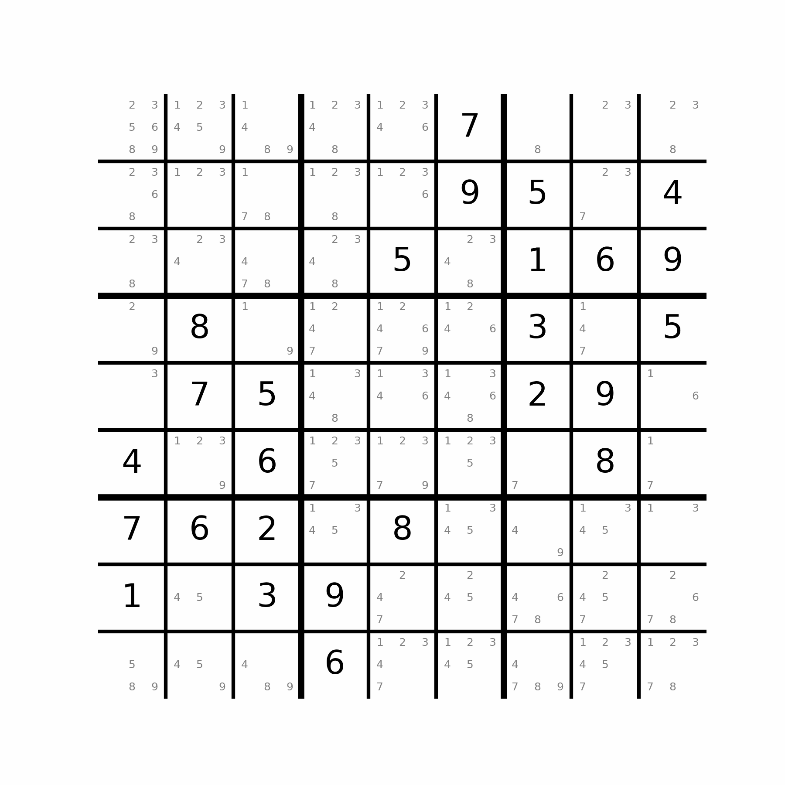

# Sudoku Solver - ivp24

This repository contains a solver for a $9\times 9$ Sudoku board.


## Table of contents
1. [Requirements](#requirements)
2. [Setup](#setup)
3. [Running the solver](#running-the-solver)
4. [Features](#features)
5. [Frameworks](#frameworks)
6. [Build status](#build-status)
7. [Credits](#credits)

## Requirements

The user should preferrably have a version of Docker installed in order to ensure correct setup of environments. If that is not possible, the user is recommended to have Conda installed, in order to set up the requirements. If Conda is also not available, make sure that the packages described in `environment.yml` are available and installed.

## Setup

We provide two different set up mechanisms using either Docker or Conda. The former is recommended, as it ensures that the environment used is identical to the one used in the development in the project.

### Using Docker

To correctly set up the environment, we utilise a Docker image. To build the image before creating the container, you can run.

```docker build -t ivp24_sudoku .```

The setup image will also add the necessary pre-commit checks to your git repository, ensuring the commits work correctly. You need to have the repository cloned beforehand, otherwise no files will be into the working directory.

Afterwards, any time you want to use the code, you can launch a Docker container using:

```docker run --name <name> --rm -ti ivp24_sudoku```

If you want to make changes to the repository, you would likely need to use your Git credentials. A safe way to load your SSH keys was to use the following command:

```docker run --name <name> --rm -v <ssh folder on local machine>:/root/.ssh -ti ivp24_sudoku```

This copies your keys to the created container and you should be able to run all required git commands.

### Using Conda

The primary concern when using Conda is to install the required packages. In this case **make sure to specify an environment name**. Otherwise, you risk overriding your base environment. Installation and activation can be done using the commands:

```conda env create --name <envname> -f environment.yml ```
```conda activate <envname> ```

## Running the solver

There are 2 different ways to run the solver. If you want to run a single sudoku puzzle, you can either:
- Provide only a text file containing the board. The solver will not display any steps made during the solution, and will use the optimal setup.
This includes all logic rules, alongside the `Selective backtracker`. An example board can be seen in `test\samples\sample_sudoku.txt`.
- Provide a full configuration, as seen in `test/configs/sample_config.ini`. You can specify both the solver configuration, as well as the visualization method. Accepted visualization methods include a text-based representation and a matplotlib animation.

The command you would like to run (while in the root folder) is:

```python run_solver.py <configuration/sudoku file>```

## Features

The scripts allow for setting up different configurations for the solver. For example, if the sudoku that is to be tried is relatively simple, less rules might result in a faster performance. We also allow for different types of visualizations, so that the process is better explained.

### The solver
The solver supports different methods of solving, all specified by a set and order of logic rules and backtracking.
A solver must always contain a set of logic rules, (perhaps empty - but this might take too long to run), and a single backtracking algorithm.
The logic rules must be chosen among `Obvious Singles`, `Hidden Singles`, `Hidden Pointers`, `Obvious Pairs`. More details on them can be found on <a href="https://sudoku.com/sudoku-rules">the Sudoku.com website</a>.

The backtracking algorithms available are a simple `Naive Backtracker`, as well as a "smarter" `Selective Backtracker`, which makes progress on the least defined cell. The latter is recommended as it can save a substantial amount of backtracking steps, and is not significantly more computationally expensive.

### Visualization

There are 2 types of visualization - text-based or animation. A text-based visualization will present the user with a step-by-step progress report. If a cell is decided, the full board will be displayed, while if only the cell possibilities have changed a single line describing the change will be presented.

The animation will present the full state of the board in the form of a Matplotlib animation. An example of the solver in action can be seen below:



### Documentation

All documentation for the repository can be generated through Doxygen by running the `doxygen` command inside the `/docs` folder. This file will be used as the front page.

### Output

An output path may be specified in the configuration so that multiple scripts can be run at the same time, with the results being stored in the specified files

## Frameworks

The entire project was built on **Python** and uses the following packages:
- For computation and parsing:
    - NumPy
    - configparser
- For plotting:
    - matplotlib
- For maintainability/documentation:
    - doxygen
    - pytest
    - pre-commit

## Build status
Currently, the build is complete and the program can be used to its full capacity.

## Credits

The `.pre-commit-config.yaml` configuration file content has been adapted from the Research Computing lecture notes.
Ideas for the logic rules were taken from <a href="https://sudoku.com/sudoku-rules">the Sudoku.com website</a>.
The example sudoku boards were found from <a href="https://github.com/dimitri/sudoku/tree/master">Dimitri Fontaine's Git repository</a> and <a href="http://sudopedia.enjoysudoku.com/Invalid_Test_Cases.html">Sudopedia</a>.
